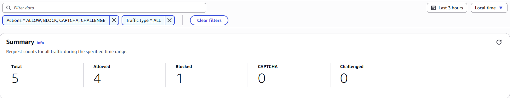
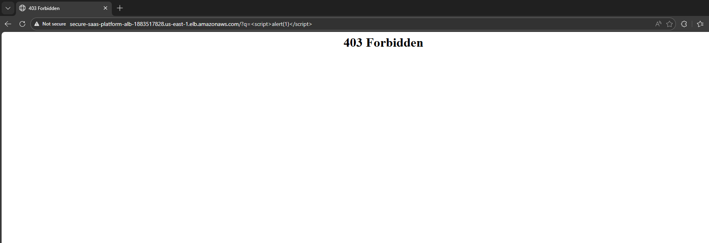
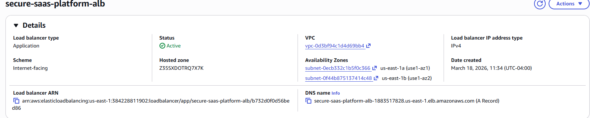
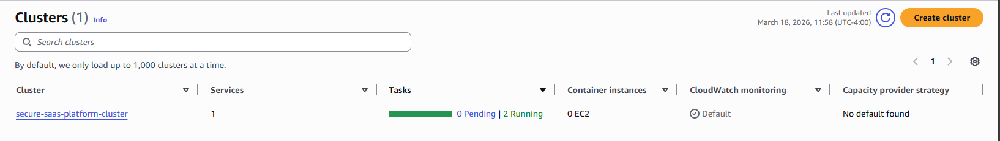
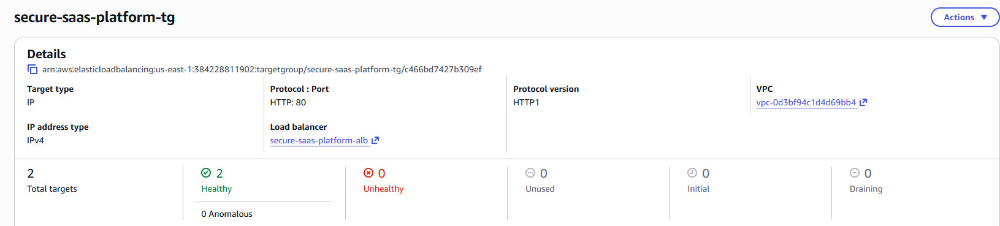
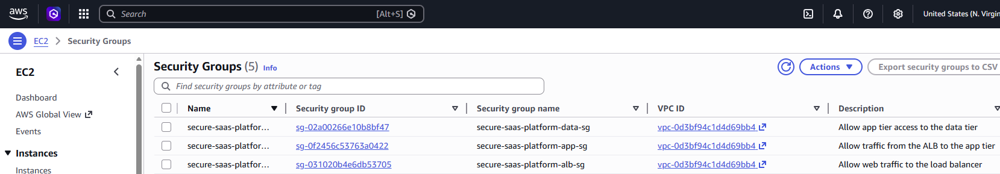

## Overview

This project implements a secure SaaS-style AWS platform designed to demonstrate how modern cloud infrastructure and security services work together in a real environment.

The platform was built with Terraform and includes a protected application entry layer, containerized backend services, a private database tier, and integrated monitoring and alerting.

The goal was to simulate how a real company might design a customer-facing platform that can scale, protect against common attacks, and provide visibility into suspicious activity.

## Business Use Case

This project simulates a secure backend platform for a subscription-based SaaS application where customers access a web interface to interact with backend services and stored data.

In a real-world scenario, this architecture could support:

- A customer dashboard for managing accounts and subscriptions  
- A web application handling user authentication and API requests  
- A backend service processing user data and business logic  

The platform is designed to handle real-world requirements such as:

- Protecting public endpoints from common web-based attacks  
- Ensuring backend services are not directly exposed to the internet  
- Storing sensitive data securely within private subnets  
- Monitoring activity for suspicious behavior and generating alerts  
- Providing scalability for handling varying user traffic  

By combining infrastructure, security controls, and monitoring services, this project reflects how a modern SaaS company might design a secure and scalable cloud environment.

## Architecture

```text
                 Internet
                    │
                    ▼
                 AWS WAF
                    │
                    ▼
         Application Load Balancer
                    │
                    ▼
            ECS Fargate Service
           (Private App Subnets)
                    │
                    ▼
               RDS Database
          (Private Data Subnets)

Security Monitoring
CloudTrail → GuardDuty → EventBridge → SNS
```

## 📸 Architecture & Validation

### 🔐 WAF Protection in Action
The platform actively blocks malicious traffic using AWS WAF.  
The request below simulates an XSS attack and is successfully denied.



---

### 🚫 403 Forbidden Response
A malicious request was sent to the application load balancer, and access was denied, proving that security rules are enforced at the edge.



---

### 🌐 Application Load Balancer (ALB)
The ALB is internet-facing and routes incoming traffic securely to backend services.



---

### ⚙️ ECS Cluster Running
Containerized application services are deployed and running with high availability across multiple tasks.



---

### 🎯 Target Group Health
All backend targets are healthy, ensuring reliable traffic routing and application uptime.



---

### 🔒 Security Groups Configuration
Strict security group rules enforce least-privilege access between ALB, application, and data layers.



---
